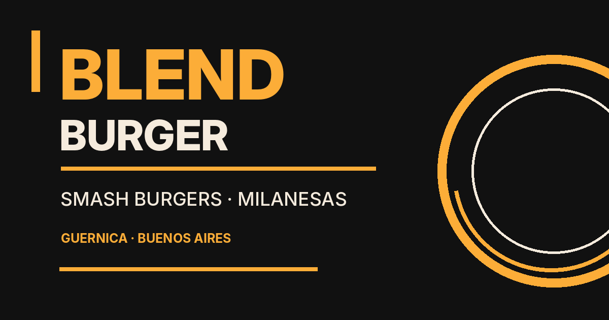

# Blend Burger 🍔

[](https://github.com/pablo-gilabert/blend-burger-demo/actions/workflows/ci.yml)

**A responsive restaurant website built with React, TypeScript, and CSS Modules.**

[Live Website](https://blend-burger-demo.vercel.app/) · [Source Code](https://github.com/pablo-gilabert/blend-burger-demo)

Blend Burger is a frontend project for a restaurant in Guernica, Buenos Aires, Argentina. It combines the restaurant's visual identity, an organized menu, and a direct WhatsApp ordering experience. The project emphasizes responsive UI, reusable components, accessibility, semantic HTML, and practical SEO.



*Brand preview image. Visit the live website to explore the actual responsive interface.*

## Features

- **Three focused pages:** Home (`/`), Menu (`/menu`), and Order (`/order`).
- **Responsive navigation:** Mobile menu, active-link states, keyboard access, and reduced-motion support.
- **Data-driven food menu:** Categories, descriptions, and ARS prices come from typed data modules.
- **Direct ordering:** A WhatsApp call to action, pickup/delivery information, and clear ordering steps.
- **Accessible structure:** One primary heading per page, semantic sections, descriptive image text, keyboard-visible focus, and a skip-to-content link.
- **Robust navigation:** Automatic scroll-to-top, `/ordernow` compatibility redirect, and a branded 404 page.
- **Route-specific SEO:** Initial HTML metadata for each public page, canonical links, Open Graph and Twitter previews, JSON-LD, robots and sitemap generation.
- **Quality automation:** TypeScript checks, Oxlint, production build checks, and Node.js smoke tests run in GitHub Actions.

## Tech Stack

| Technology | Purpose |
| --- | --- |
| React 19 + TypeScript | UI components and type-safe data |
| Vite 8 | Development and production bundling |
| React Router 7 | Client-side routing |
| CSS Modules | Locally scoped component and page styles |
| CSS custom properties | Shared design tokens |
| SVG | Reusable, lightweight interface icons |
| Oxlint | Static analysis |
| Node.js test runner | Production-output smoke tests |
| GitHub Actions | Continuous integration |
| Vercel | Deployment and route configuration |

Typography uses **Anton** for display text and **Inter** for supporting copy. The palette pairs cream, black, and orange.

## Pages

| URL | Description |
| --- | --- |
| `/` | Restaurant introduction, featured menu content, responsive photography, and a link to the menu. |
| `/menu` | Single-column food menu across mobile and desktop with sections, descriptions, and prices. |
| `/order` | WhatsApp ordering CTA, service options, ordering steps, and contact information. |
| `/ordernow` | Permanent redirect to `/order` in production. |
| Unknown paths | Custom 404 experience with a return-to-home link. |

## Architecture

The shared application shell mounts Navbar and Footer once, while React Router renders the active page inside the main landmark. Product and order information live outside the presentational components, in separate data modules. CSS Modules isolate page-level styling; the global stylesheet handles the reset and shared defaults.

```text
blend-burger/
├── .github/workflows/ci.yml
├── public/
│   ├── favicon.svg
│   └── og-blend-burger.png
├── scripts/
│   ├── generate-seo.mjs
│   └── check-seo.mjs
├── src/
│   ├── assets/                 # Original brand photography and logo
│   ├── components/             # Navbar, Footer, and Icon
│   ├── data/                   # Typed menu and ordering data
│   ├── pages/                  # Home, Menu, Order, and NotFound
│   ├── seo/                    # Route metadata and structured data
│   ├── styles/                 # Design tokens
│   ├── App.tsx
│   ├── app.module.css
│   ├── index.css
│   └── main.tsx
├── tests/production.test.mjs
├── index.html
├── package.json
├── vercel.json
└── vite.config.ts
```

## Local Development

Install a Node.js release compatible with Vite 8 (this project uses Node 22 in `.nvmrc`) and npm. The existing repository includes the original brand assets and dependency lockfile.

```bash
# Clone the original repository, including its existing assets and lockfile.
git clone https://github.com/pablo-gilabert/blend-burger-demo.git
cd blend-burger-demo

# Install exact locked dependencies and start the development server.
npm ci
npm run dev
```

Open the local URL shown by Vite, generally `http://localhost:5173`.

### Scripts

| Command | Purpose |
| --- | --- |
| `npm run dev` | Start the development server. |
| `npm run lint` | Run Oxlint. |
| `npm run build` | Type-check, bundle, generate route HTML, and validate SEO. |
| `npm run seo:check` | Validate generated SEO files after building. |
| `npm test` | Run production-output smoke tests after building. |
| `npm run validate` | Run lint, production build, and smoke tests in sequence. |
| `npm run preview` | Preview the production build. |

## SEO and Deployment

Set `VITE_SITE_URL` to the public production origin on Vercel:

```dotenv
VITE_SITE_URL=https://blend-burger-demo.vercel.app
```

An optional `GOOGLE_SITE_VERIFICATION` variable can hold a Search Console verification token. See `.env.example` for the documented values. For the standalone SEO generator, production variables must be present in the process environment; copying `.env.example` without configuring them is not sufficient.

The production build generates initial, route-specific HTML documents for `/`, `/menu`, and `/order`, along with `404.html`, `robots.txt`, and a sitemap when a valid production origin is supplied. The menu's structured data derives product names and prices from `src/data/menuData.ts` instead of maintaining another price list.

The visible React app remains client-rendered; route-specific initial metadata is not equivalent to full static rendering or SSR. SEO implementation does not guarantee search rankings or indexing. Preview deployments use `noindex` metadata.

In Vercel, direct `/menu` and `/order` requests are rewritten to their generated HTML documents, and `/ordernow` is permanently redirected. Confirm HTTP status codes and indexing in the deployed environment, especially for unknown paths.

## Accessibility and UI Decisions

The design intentionally retains a **single vertical menu column** on desktop as well as mobile, so product names, ingredients, and prices remain easy to scan. Shared focus styles and the skip link support keyboard navigation, while the mobile menu exposes its expanded state and supports dismissal with Escape.

Images use responsive sources or deferred loading where appropriate. The primary hero image gets elevated loading priority. Comments and identifiers in the source are written in English; visible restaurant copy is localized for the Argentine audience.

## Quality Checks

The CI workflow runs on pushes to `main` and pull requests. It installs dependencies from `package-lock.json`, runs linting, builds the site with its real deployment origin, and executes smoke tests against the generated files. Those tests inspect page titles, descriptions, canonical URLs, structured menu data, the legacy redirect, the 404 metadata, and output assets.

Run the same checks locally with:

```bash
npm ci
npm run validate
```

## Maintaining the Content

- `src/data/menuData.ts`: Edit products, categories, ingredients, and prices.
- `src/data/orderData.ts`: Edit ordering copy and the official WhatsApp destination.
- `src/seo/pages.json`: Edit route titles and descriptions.
- `src/seo/business.json`: Maintain **verified** restaurant details only.
- `src/styles/variables.css`: Update global design tokens without duplicating values across modules.

Confirm published prices, service availability, and business details with the restaurant before deploying. Precise street addresses, phone numbers, and opening hours have not been invented.

## Project Scope

This is a restaurant **frontend**, not an e-commerce backend. Orders are completed through the restaurant's WhatsApp link rather than an integrated shopping cart, payment gateway, or order-management system. Automated end-to-end browser tests and full content SSR are possible future enhancements, rather than features claimed to be implemented.

## Author

**Pablo Gilabert** · [GitHub](https://github.com/pablo-gilabert)

Developed as a practical frontend project with an emphasis on responsive design, code organization, accessibility, and maintainable real-world interfaces.

---

*Restaurant identity and food photography are project-specific assets and are not offered for general reuse. No open-source license is implied for those assets.*
